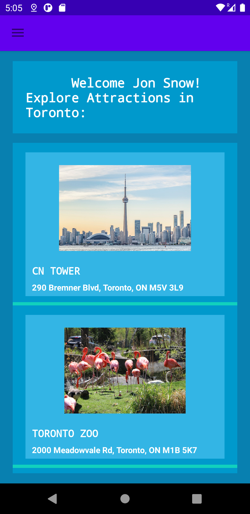
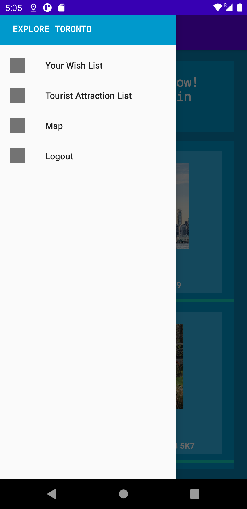
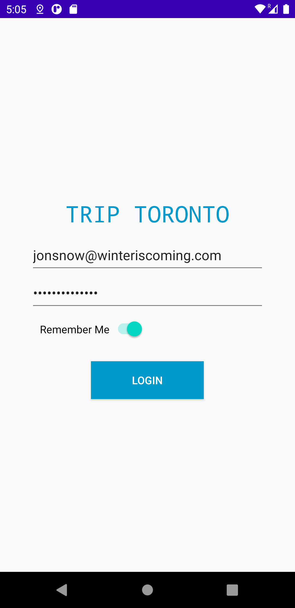
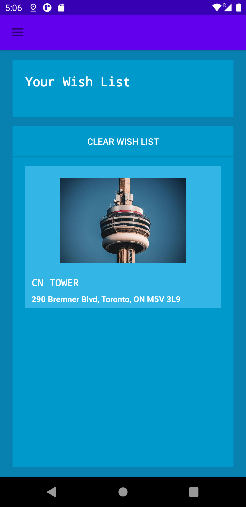

# TOURISM APP (Android Native)

#### APP DESCRIPTION:
The app promotes and encourages tourism within the city of Toronto by show casing different tourist spots around the city.
The App was made using **Android Studio**, **Java** and **XML**. The database consists of five tourist spots and four users.

#### LOGIC IMPLEMENTATION:
* Where required, used **object oriented programming** principles 
* Data between screens was be passed using **intents**.  
* Data persisted with **SharedPreferences** and **JSON** files.

#### USER INTERFACE:
* Provided navigation drawers and toolbars. 
* Multiple screens implemented using navigation as well as intents. 
* List views show tourist attractions. 
* Buttons that naviagte you to **WebViews**.

#### FEATURES OF THE APP:
* User account login 
* Provided a screen that would  allow users to login by entering the following credentials : Username and Password
* Added a Remember Me **CheckBox** -  If the user has this checked, they will be automatically logged in and navigated to the Tourist Attraction List screen.

The app can validate with the below users.
**Note:** Users are statically added and loaded from a JSON file.

#### USERNAMES AND PASSWORDS
1. thanos@gmail.com  -  1234
2. wonderwoman@yahoo.com - abc00021
3. jonsnow@winteriscoming.com - gameofthrones2
4. superman@kypton.com - kk11iii

#### TOURIST ATTRACTION LIST:
* A list of popular tourist attractions in the city. 
* This list shows the attraction name, address and photo. 
* Implemented using a custom List View and Adapter. 
* Tourist attractions were loaded from a JSON file stored in the assets folder. 

#### WISH LIST:
* The app allows users to add a tourist attraction to their “wish list” of things to see. 
* It is clear from the UI which attractions are added to the wish list. 
* If the user closes the app and relaunches the app, the app remembers which attraction was on the wishlist. 
* Implemented using a **ListView**.
* The user can clear wish list by pressing the "Clear Wish List" button.

#### ATTRACTION DETAILS SCREEN:
When a user selects an attraction from the list, the app displays a screen that shows more detailed information about the attraction. 
On this page you can see the following:
* name
* address
* phone no: Clicking on the phone number automatically opens the phone dialer so the user can attempt to call said place.
* website: Clicking on the website automatically opens a web view showing the attraction web page.
* more photos
* description
* pricing 
* ratings: Users are able to leave a star rating for the tourist attraction. Implemented using a “Rating Bar” view.

#### GENERAL UI FEATURES:
The app has a navigation drawer and the navigation drawer contains the following:-
* **Your Wish List** - This will naviagte the user to their wish list. If it has no items to show then the screen will say "Your wish list is empty!"
* **Tourist Attraction List** - This will navigate the user to the Tourist Navigation List.
* **Map** -  For this screen, a web view is loaded that displays a  bing.com map that is centered to a random location. This was implemented using 
* **Logout**  - Clicking this link will logout the user and redirect them back to the Login screen. 

